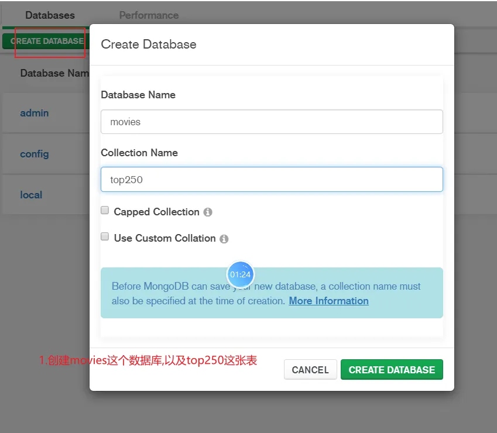
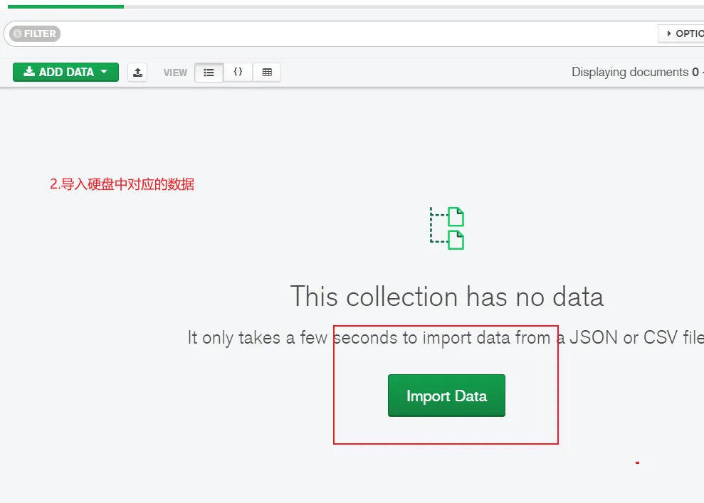

### 项目启动说明
##### 本项目是一个Vue+Koa+MongoDB的电影web小demo，包含了三个页面：index.html,add.html,detail.html。后端代码在index.js里面

原始数据放在data文件夹里面，先把data文件夹里面的数据导入数据库中，然后就可以启动项目了



```
项目参考文档：https://www.yuque.com/chengbenchao/ygupum
```
1,下载项目依赖
```
pnpm install
```
2,启动项目
```
pnpm start
```
3，mongoDB数据库连接成功
```
服务器运行在 http://localhost:8080
Mongoose 连接成功
```